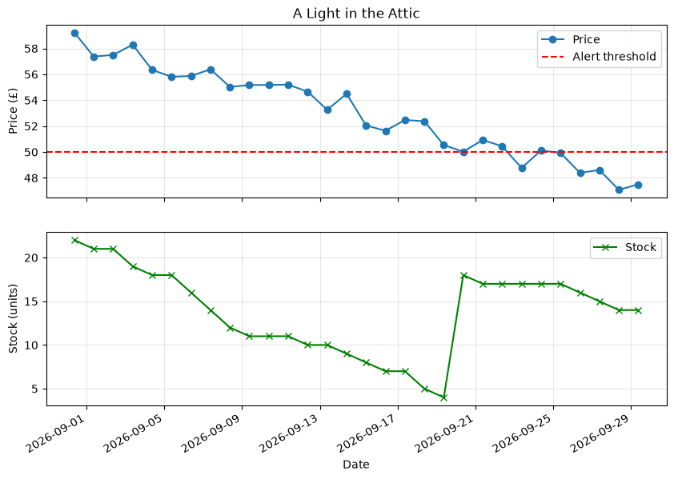

# scrapPrice

An automation that scrapes a product page every day, stores its price and stock history in a SQLite database, draws a graph of that history, and sends an alert by email and/or Telegram when the price drops.

The HTML selectors used by the extractor (`h1`, `p.price_color`, `p.availability`) match product pages from [Books to Scrape](https://books.toscrape.com/).

## Features

- **Scraping**: downloads a product page and parses it with BeautifulSoup.
- **Extraction**: pulls the title, price and stock quantity from the page.
- **Storage**: saves every scraping result in a SQLite database (`data.db`).
- **Graph**: plots the price (with an optional alert threshold) and the stock over time, saved as a PNG image.
- **Alerts**: sends a price drop notification by email (SMTP over SSL) and/or through a Telegram bot, with the graph attached.



*Graph generated from the demo data (see [Demo data](#demo-data)): the price falls below the £50 alert threshold, which triggers the alerts.*

## Tech stack

Python · requests · BeautifulSoup · SQLite · Matplotlib · SMTP · Telegram Bot API · cron

## Project structure

```
scrapPrice/
├── main.py                 # Entry point
├── demo_data.py            # Generates fake history and graphs for demos
├── requirements.txt        # Python dependencies
├── docs/
│   └── demo_graph.png      # Graph preview used in this README
├── tests/
│   ├── send_mail.py        # Sends a test email alert
│   └── send_telegram.py    # Sends a test Telegram alert
├── .env .example           # Template for the environment variables
└── src/
    ├── core/
    │   ├── scraper.py      # Scraper: download and parse a page
    │   ├── extract.py      # Extract: get title, price and stock from the page
    │   └── render.py       # Render: draw the price/stock history graph
    └── utils/
        ├── save.py         # Save: SQLite storage of products and price history
        ├── mail.py         # Mail: email alerts
        └── telegram.py     # Telegram: Telegram bot alerts
```

## Requirements

- Python 3.9+
- Dependencies:

```bash
pip install -r requirements.txt
```

## Configuration

Copy `.env .example` to `.env` and fill in the values:

| Variable           | Description                                                                 |
| ------------------ | --------------------------------------------------------------------------- |
| `MAIL_SENDER`      | Email address used to send the alerts                                       |
| `MAIL_PASSWORD`    | Password of the sender account (for Gmail, use an [app password](https://support.google.com/accounts/answer/185833)) |
| `TELEGRAM_TOKEN`   | Token of your Telegram bot (given by [@BotFather](https://t.me/BotFather))  |
| `TELEGRAM_CHAT_ID` | ID of the chat where the bot sends the messages                             |

`main.py` loads the `.env` file automatically with `python-dotenv`, and the classes then read these values with `os.getenv`. If you use the classes from another script, call `load_dotenv()` first (or export the variables in your shell).

### Testing the alerts

Once `.env` is filled in, check that the notifications work by sending a test alert (sample product at £47.50, below a £50.00 threshold, with `docs/demo_graph.png` attached):

```bash
python tests/send_mail.py                    # sends the email to MAIL_SENDER (yourself)
python tests/send_mail.py someone@example.com  # or to another address
python tests/send_telegram.py                # sends the message to TELEGRAM_CHAT_ID
```

Each script prints whether the alert was sent or, if not, why (missing variable, wrong password, invalid token, etc.).

## Usage

Example of a full run:

```python
from dotenv import load_dotenv

from src.core.scraper import Scraper
from src.core.extract import Extract
from src.core.render import Render
from src.utils.save import Save
from src.utils.mail import Mail
from src.utils.telegram import Telegram

load_dotenv()

link = "https://books.toscrape.com/catalogue/a-light-in-the-attic_1000/index.html"
threshold = 50.0

# 1. Scrape and extract the product data
scraper = Scraper(link)
page = scraper.scraping()
if page is None:
    print(scraper.getError())

data = Extract(page, link).extractData()

# 2. Save it in the database (data/data.db)
save = Save("data")
save.saveData(data)
save.closeSaving()

# 3. Draw the history graph (graphs/<title>.png)
history = {
    "date":  ["2026-09-27T09:00:00", "2026-09-28T09:00:00", "2026-09-29T09:00:00"],
    "price": [55.0, 53.2, data["price"]],
    "stock": [22, 21, data["stock"]],
}
Render(data["title"], history, "Date", "Price (£)", threshold=threshold).graph()

# 4. Send the alerts if the price dropped below the threshold
if data["price"] is not None and data["price"] <= threshold:
    mail = Mail("you@example.com")
    if not mail.send(data, threshold, attachment="graphs/A_Light_in_the_Attic.png"):
        print(mail.getError())

    telegram = Telegram()
    if not telegram.send(data, threshold, attachment="graphs/A_Light_in_the_Attic.png"):
        print(telegram.getError())
```

## Demo data

To try the project without waiting for days of scraping, generate a fake history:

```bash
python demo_data.py
```

This fills `data/data.db` with 30 days of daily readings for 3 Books to Scrape products and draws their graphs in `graphs/`:

| Product              | Price (first day → today) | Alert threshold | Alert triggered |
| -------------------- | ------------------------- | --------------- | --------------- |
| A Light in the Attic | £59.23 → £47.50           | £50.00          | Yes             |
| Tipping the Velvet   | £54.15 → £51.20           | £45.00          | No              |
| Soumission           | £50.43 → £38.40           | £40.00          | Yes             |

The data is generated with a fixed random seed, so every run gives the same values.

> **Warning:** the script empties the `products` and `price_history` tables before inserting the demo data, so any real scraping history in `data/data.db` is lost.

## Database schema

The database is stored in `<path>/data.db` and contains two tables:

- **products**: `id`, `url` (unique), `title`, `threshold`
- **price_history**: `id`, `product_id` (→ `products.id`), `price`, `stock`, `scraped_at` (ISO 8601 timestamp)

## Running it automatically

### Linux / macOS (cron)

First, find the path of your Python interpreter:

```bash
which python3
```

Then open your crontab:

```bash
crontab -e
```

And add this line, replacing the paths with your own:

```
0 * * * * cd /home/tao/price-tracker && /home/tao/price-tracker/venv/bin/python main.py >> logs/cron.log 2>&1
```

This runs the script at the start of every hour and appends its output and errors to `logs/cron.log`. The `logs/` folder must exist (`mkdir logs`). To run it once a day instead (e.g. at 9:00), replace `0 * * * *` with `0 9 * * *`.

### Windows

Create a task in the Task Scheduler that runs `python main.py` in the project folder.

## Error handling

`Scraper`, `Mail` and `Telegram` never raise on network errors: their methods return `None` / `False` and the error can be retrieved with `getError()`.

## Author

Tao Serveaux
